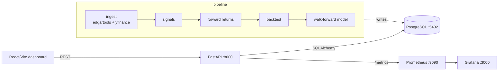
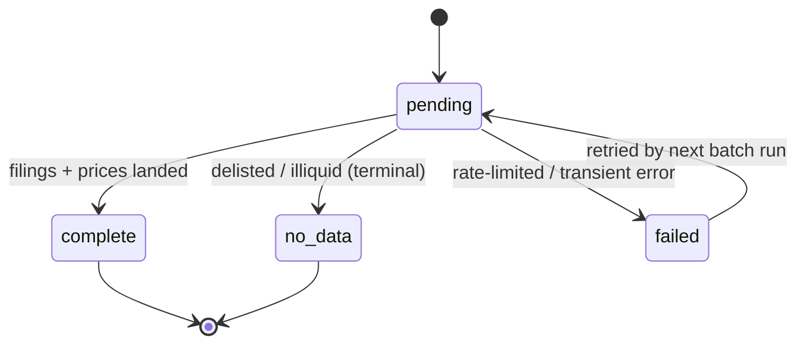

# FilingAlpha

**Backtested text signals from SEC filings — classical NLP, no LLM.**

FilingAlpha turns the *text* of SEC 10-K and 10-Q filings into quantitative trading signals
using established finance-NLP methods, then tests — with rigorous, lookahead-free
backtesting — whether those signals predict forward stock returns. It is a
production-shaped backend (FastAPI + PostgreSQL + Docker + Prometheus/Grafana),
not a notebook.

The point is not to claim a money-printing edge. It is to **replicate documented
academic signals and measure them honestly** with the same discipline a
quant-research team would demand: point-in-time data, no lookahead, transaction
costs, information coefficients, and event-study tercile spreads.

---

## Signals (each anchored to published research)

| Signal | Definition | Reference |
|--------|-----------|-----------|
| **Loughran-McDonald tone** | Fraction of words in the LM finance dictionary's *Negative / Uncertainty / Litigious* categories | Loughran & McDonald (2011), *J. Finance* |
| **YoY textual change ("Lazy Prices")** | TF-IDF cosine similarity to the prior year's 10-K — low similarity (big change) is the predictive event | Cohen, Malloy & Nguyen (2020), *J. Finance* |
| **Risk-factor delta** | `1 − cosine` of Item 1A (Risk Factors) year-over-year | — |
| **Readability (Fog)** | Gunning-Fog index of the MD&A | Li (2008), *J. Acct. Econ.* |

> The three Loughran-McDonald categories are scored as separate columns, so the pipeline
> produces **six signal columns** in all: `lm_negative`, `lm_uncertainty`, `lm_litigious`,
> `yoy_similarity`, `risk_factor_delta`, `fog_readability`.

> The Loughran-McDonald **Master Dictionary** is not redistributed here. Download it
> from [sraf.nd.edu](https://sraf.nd.edu/loughranmcdonald-master-dictionary/) to
> `data/raw/lm_master_dictionary.csv`; without it, a small bundled fallback lexicon
> is used so the code runs offline.

## Backtest rigor

- **Point-in-time / filing-lag** — a filing's signal is only actionable *after* it is
  filed; forward returns start from the first trading day **strictly after** the
  filing date. No same-day lookahead.
- **Walk-forward, expanding window** — the ML model only ever trains on data that
  precedes the test fold. A unit test asserts `max(train date) < min(test date)` for
  every fold.
- **Honest metrics** — Spearman information coefficient (with t-stat) and an
  event-study tercile spread: top-minus-bottom forward return (net of transaction
  costs) with a Welch t-stat. Annual filings are too sparse for a per-rebalance-date
  long-short portfolio, so each filing is treated as an independent event. Weak,
  insignificant signals are reported as weak.

## Architecture



- `core/` — shared SQLAlchemy models, Pydantic schemas, DB session, settings.
- `pipeline/` — ingest, the classical-NLP signals, returns, backtest, model.
- `api/` — FastAPI read API over the computed tables.
- `frontend/` — Vite + React + Tremor dashboard (Signal Explorer, Backtest, Model).
- `migrations/` — Alembic.
- `monitoring/` — Prometheus + Grafana provisioning.

## Data & ingestion

The universe is a **2018-anchored small/mid-cap panel of 300 firms** (`data/universe/smallmid_2018.json`),
built point-in-time so membership reflects what was investable in 2018 — delisted and renamed names are
**kept**, not dropped, which is what makes the event study survivorship-bias-correct. Each firm carries both
a ticker and a **CIK**; EDGAR is resolved by CIK so a firm that later renamed or delisted still resolves
instead of erroring out.

Ingestion is **resumable and shardable**. Every firm carries an `ingest_state`, so a run interrupted by a
Yahoo/SEC rate limit is never left looking "done" with partial data — the next batch retries exactly the
firms that still need work. Because the work is latency/CPU-bound and far under SEC's 10 req/s limit, N
processes can each own a disjoint slice of the universe (`--num-shards N --shard k`) for a near-linear
speedup. The same sharding drives signal computation (`scripts/compute_signals_shard.py`).



A full run this way ingests **300 firms → 11,671 filings (2,744 10-K + 8,927 10-Q) and 603,350 daily
closes**, resumable in `--batch` chunks:

```bash
uv run python scripts/ingest_batch.py --batch 15                 # chip the next 15 firms
uv run python scripts/ingest_batch.py --num-shards 5 --shard 0   # one of 5 parallel workers
```

## Quickstart

```bash
cp .env.example .env
uv venv --python 3.11 && uv pip install -e ".[dev]"

docker compose up -d postgres                 # or: docker compose up -d  (full stack)
uv run alembic upgrade head                   # create schema
uv run python scripts/run_pipeline.py         # ingest -> signals -> returns -> backtest -> model
uv run pytest                                  # offline suite (integration tests auto-skip)

# explore
curl localhost:8000/signals/AAPL
curl localhost:8000/backtests
# UI: http://localhost:5173   Grafana: http://localhost:3000   Prometheus: http://localhost:9090
```

Run the full stack with `docker compose up`. Integration tests require Postgres and
network; enable them with `RUN_INTEGRATION=1 uv run pytest -m integration`.

## Backtest results

Universe: a **2018-anchored small/mid-cap universe** (\$300M–\$10B cap band, sector-balanced, survivorship-aware —
built point-in-time by `scripts/build_universe.py`, resolved by CIK so renamed/delisted firms are kept). This run
ingested **300 firms** (299 with complete price history), **11,671 filings** (2,744 10-K + 8,927 10-Q),
**603,350 daily closes**, and two forward horizons (21 and 63 trading days). Results are reported straight.

**Headline:** on 10-Ks, the **Loughran-McDonald negative-tone** signal reproduces the documented anomaly with
statistical significance — more negative tone predicts *lower* filing-lagged forward returns, significant on *both*
the rank-IC (with t-stat) and the event-study top-minus-bottom tercile spread (net of 10 bps/side, with a Welch
t-stat):

| Signal (10-K)      | Horizon | IC | IC t | L-S spread | Spread t |
|--------------------|--------:|------:|------:|-----------:|---------:|
| lm_negative        | 21 | -0.092 | **-2.90** | -0.0169 | **-2.28** |
| lm_negative        | 63 | -0.047 | -1.56 | -0.0206 | -1.54 |
| fog_readability    | 63 |  0.004 |  0.12 |  0.0156 |  1.51 |
| lm_uncertainty     | 21 | -0.034 | -1.14 | -0.0074 | -0.81 |

On 10-Qs one IC clears \|t\|>2 (lm_uncertainty 63d, t=2.41) but no tercile spread does and the signs are
inconsistent — noise at this sample size. The remaining signal×horizon cells are insignificant. (The full 24-row
table is printed by `scripts/run_pipeline.py`.)

**Walk-forward classifier** (GradientBoostingClassifier, 5 expanding-window folds; **10-K only**, since
`yoy_similarity` and `risk_factor_delta` are year-over-year signals and undefined for 10-Qs):

| Horizon | Folds | OOS obs | OOS accuracy | OOS ROC-AUC |
|--------:|------:|--------:|-------------:|------------:|
| 21d | 5 | 1,868 | 0.532 | 0.504 |
| 63d | 5 | 1,853 | 0.545 | 0.509 |

The nuance is the point: a **statistically significant cross-sectional event-study signal** (LM negative tone,
IC t=-2.90, spread t=-2.28) that **does not compound into an out-of-sample tradeable classifier** (OOS accuracy
~coin-flip over ~1,860 held-out filings).
That gap — real in-sample signal, no OOS edge once the temporal split is enforced — is exactly what a rigorous,
leakage-free harness is built to reveal. The deliverable is the **measurement discipline** (point-in-time filing
lag, cross-sectional IC, event-study tercile spread, an expanding-window walk-forward that asserts
`max(train date) < min(test date)`), not an alpha claim.

## Tech

FastAPI · PostgreSQL · SQLAlchemy 2.0 · Alembic · scikit-learn · pandas · edgartools ·
yfinance · textstat · Vite/React/TypeScript/Tremor · Docker Compose · Prometheus · Grafana

## Resume angles

- **Backend/SDE** — typed FastAPI (routers by domain, DI'd sessions, Pydantic contracts),
  Postgres + Alembic migrations, idempotent ingestion, Docker, CI, Prometheus metrics.
- **Hedge-Fund DS** — published text signals, point-in-time/no-lookahead backtest,
  transaction costs, rank-IC + t-stat + event-study tercile spread.
- **Applied ML** — walk-forward classifier on the engineered features, OOS evaluation.
